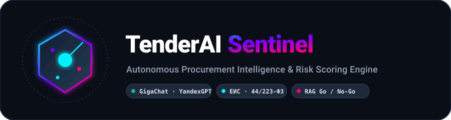
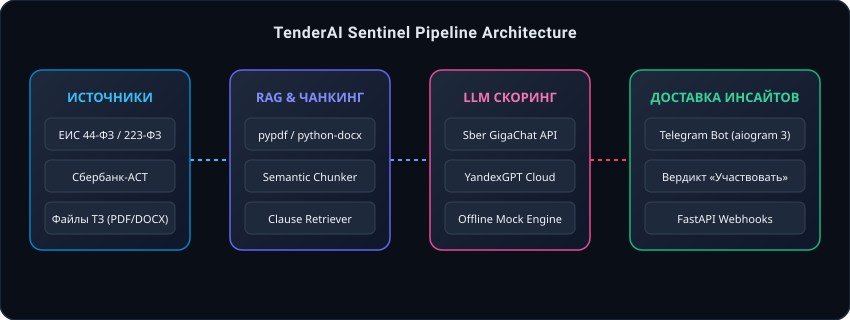

<div align="center">



### Autonomous Procurement Intelligence &amp; Risk Scoring Engine

[](https://www.python.org/)
[](https://developers.sber.ru/)
[]()
[](https://docs.aiogram.dev/)
[](https://fastapi.tiangolo.com/)
[-10B981.svg)]()
[](https://www.docker.com/)
[](LICENSE)

</div>

**TenderAI Sentinel** — интеллектуальная система мониторинга государственных и коммерческих закупок (**ЕИС Госзакупки**, **Сбербанк-АСТ**, **РТС-тендер**) с автоматическим семантическим разбором документации и ТЗ (PDF/DOCX), RAG-поиском скрытых рисков и принятием решения **«Участвовать / Не участвовать»** через отечественные LLM (**Сбер GigaChat** и **YandexGPT**).

```bash
git clone https://github.com/Nari-Ab/tender-ai-bot && cd tender-ai-bot
docker compose up --build   # запускает REST API и Telegram-бота (демо-режим без ключей)
```

---

## ⚡ Живая демонстрация работы

Ниже показан процесс загрузки файла технического задания в Telegram-бота, RAG-чанкинг и моментальный скоринг рисков через GigaChat API:

<div align="center">
  
</div>

---

## 🔍 Пример анализа закупки (Finding Record)

Пример структурированного вердикта по закупке вычислительных комплексов для ЦОД (НМЦК 48 млн ₽):

```text
⛔️ РЕЗЮМЕ АНАЛИЗА ЗАКУПКИ № 0373100012324000999 (44-ФЗ)
============================================================
📊 Рекомендация:    ВЫСОКИЙ РИСК (НЕ УЧАСТВОВАТЬ)
🔴 Индекс риска:    95 / 100
💰 Финансы:         НМЦК: 48,000,000 ₽ · Обеспечение: 14,400,000 ₽ (30%)

🚨 ВЫЯВЛЕННЫЕ КРИТИЧЕСКИЕ ЛОВУШКИ И КАБАЛЬНЫЕ УСЛОВИЯ (4):

  ● [Сроки | CRITICAL] — Срок поставки 3 календарных дня с даты контракта
      └─ Риск сговора: невозможно произвести и поставить 48 серверов за 72 часа
  
  ● [Штрафы | HIGH] — Неустойка 2% в день (960 000 ₽/сутки)
      └─ Превышает законную ставку 1/300 ЦБ РФ (ПП РФ №1042) более чем в 20 раз
  
  ● [Обеспечение | HIGH] — 30% живыми деньгами на счет заказчика
      └─ Прямой запрет использования банковских гарантий (кассовый разрыв)

  ● [Требования | MEDIUM] — Обязательна лицензия ФСБ формы 2 и сертификаты СТ-1
      └─ Требуется предоставление документов уже на этапе первой части заявки

ВЕРДИКТ
  Подача заявки не рекомендуется: максимальный риск срыва сроков и попадания в РНП.
```

---

## 🏛 Архитектура решения

Система построена на принципах **Clean Architecture** с полным разделением инфраструктурных адаптеров, бизнес-логики и интерфейсов доставки:

<div align="center">
  
</div>

---

## ✨ Ключевые возможности

- 📡 **Мониторинг источников:** Потоковый сбор и фильтрация тендеров с ЕИС Госзакупки (44-ФЗ, 223-ФЗ) и Сбербанк-АСТ по отраслям (ИТ, серверное оборудование, ПО, разработка).
- 📑 **RAG-пайплайн для ТЗ:** Парсинг файлов любого объема (**PDF**, **DOCX**, **TXT**), семантический чанкинг с учетом юридической структуры контракта.
- 🇷🇺 **Двойной отечественный LLM-стек:**
  - **Сбер GigaChat API:** официальный REST/SDK с авторизацией по сертификатам Минцифры и системным JSON-модом.
  - **Yandex Cloud Foundation Models (YandexGPT):** Completion API для суммаризации и извлечения сущностей.
  - **Offline Heuristic Mock:** детерминированный движок для тестов и ревью без затрат токенов.
- ⚖️ **Движок скоринга рисков:** Распознавание признаков «заточки» под аффилированного поставщика, скрытых требований, кабальных неустоек и штрафов.
- 🤖 **Telegram-бот (aiogram 3):** Интерактивные кнопки, рассылка утренних дайджестов, аудит прикрепленных файлов прямо в чате.
- 🔌 **Enterprise REST API (FastAPI):** Эндпоинты `/health`, `/api/tenders`, `/api/analyze` для интеграции с CRM/ERP.

---

## 🚀 Быстрый запуск

### Вариант 1: Docker (Рекомендуемый)

```bash
# Клонирование
git clone https://github.com/Nari-Ab/tender-ai-bot.git
cd tender-ai-bot

# Запуск в 1 команду (по умолчанию в демо-режиме с Mock LLM)
docker compose up --build
```
> API доступно по адресу: `http://localhost:8000/docs`

### Вариант 2: Локально на Python 3.11+

```bash
# Создание виртуального окружения
python3 -m venv .venv
source .venv/bin/activate

# Установка зависимостей
pip install -r requirements.txt

# Запуск тестов (100% passing)
pytest tests/ -v

# Запуск веб-сервера
uvicorn src.api.main:app --reload --port 8000

# Запуск Telegram-бота (при наличии токена в .env)
python -m src.bot.bot
```

---

## ⚙️ Конфигурация (.env)

```env
# Выбор провайдера: mock | gigachat | yandexgpt
LLM_PROVIDER=mock

# Сбер GigaChat API
GIGACHAT_CREDENTIALS=your_auth_key
GIGACHAT_SCOPE=GIGACHAT_API_PERS
GIGACHAT_VERIFY_SSL=false

# YandexGPT Cloud
YANDEX_API_KEY=your_api_key
YANDEX_FOLDER_ID=your_folder_id

# Telegram Bot
TELEGRAM_BOT_TOKEN=123456789:ABCdef...
```

---

## 🧪 Тестирование

Проект покрыт автоматическими тестами:

```bash
pytest tests/ -v
```

```text
tests/test_api.py::test_health_check_endpoint PASSED                     [  6%]
tests/test_api.py::test_get_tenders_endpoint PASSED                      [ 13%]
tests/test_api.py::test_analyze_tender_endpoint PASSED                   [ 20%]
tests/test_core_models.py::test_tender_info_creation PASSED              [ 26%]
tests/test_core_models.py::test_analysis_result_validation PASSED        [ 33%]
tests/test_core_models.py::test_settings_defaults PASSED                 [ 40%]
tests/test_documents.py::test_extract_text_from_txt PASSED               [ 46%]
tests/test_documents.py::test_chunker_splits_paragraphs PASSED           [ 53%]
tests/test_documents.py::test_clause_retriever_detects_risks PASSED      [ 60%]
tests/test_llm_providers.py::test_mock_llm_evaluates_risky_tender PASSED [ 66%]
tests/test_llm_providers.py::test_mock_llm_evaluates_ok_tender PASSED    [ 73%]
tests/test_llm_providers.py::test_factory_returns_mock_when_selected PASSED [ 80%]
tests/test_scoring.py::test_scoring_engine_full_workflow PASSED          [ 86%]
tests/test_zakupki_parser.py::test_zakupki_feed_monitor_filters PASSED   [ 93%]
tests/test_zakupki_parser.py::test_zakupki_feed_monitor_by_id PASSED     [100%]

============================== 15 passed in 0.20s ==============================
```

---

## 📂 Структура проекта

```text
tender-ai-bot/
├── docs/
│   └── assets/             # SVG-логотип, анимированное демо, схема архитектуры
├── sample_data/            # Примеры реальных ТЗ (безопасные и с ловушками)
├── src/
│   ├── api/                # FastAPI маршруты и схемы
│   ├── bot/                # Telegram-бот на aiogram 3 (хэндлеры, кнопки)
│   ├── core/               # Настройки (pydantic-settings), модели, логирование
│   └── services/
│       ├── documents/      # Парсер документов (PDF/DOCX) и чанкер
│       ├── llm/            # Адаптеры GigaChat, YandexGPT, Mock LLM
│       ├── parsers/        # Монитор закупок ЕИС и Сбербанк-АСТ
│       ├── rag/            # Семантический поиск риск-кластеров
│       └── scoring/        # Движок принятия решений Go / No-Go
├── tests/                  # Pytest набор юнит- и интеграционных тестов
├── Dockerfile              # Мульти-стейдж Docker образ
├── docker-compose.yml      # Оркестрация API и Бота
└── requirements.txt        # Зависимости Python
```

---

## 📄 Лицензия
Распространяется под лицензией [MIT](LICENSE).

Разработано: **[Nari-Ab](https://github.com/Nari-Ab)**
